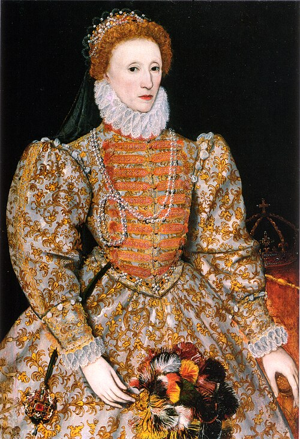

# Elizabeth I

- **Name**: Elizabeth I
- **Image**: Darnley stage 3.jpg
- **Caption**: The Darnley Portrait,
- **Alt**: Full-length portrait of Queen Elizabeth in her early 40s. She has red hair, fair skin, and wears a crown and a pearl necklace.
- **Succession**: Queen of England and Ireland
- **More Text**: (more...)
- **Reign**: 17 November 1558–; 24 March 1603
- **Coronation**: 15 January 1559
- **Cor Type**: Coronation
- **Predecessor**: Mary I and Philip
- **Successor**: James I
- **House**: Tudor
- **Father**: Henry VIII of England
- **Mother**: Anne Boleyn
- **Birth Date**: 7 September 1533
- **Birth Place**: Palace of Placentia, Greenwich, England
- **Death Date**: 24 March 1603 (aged 69)
- **Death Place**: Richmond Palace, Surrey, England
- **Burial Date**: 28 April 1603
- **Burial Place**: Westminster Abbey
- **Signature**: Autograph of Elizabeth I of England.svg
- **Religion**: Anglicanism
