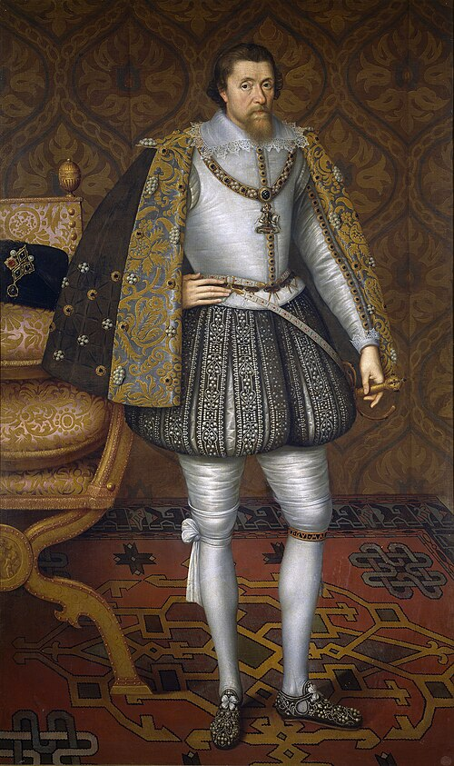

# James VI and I

- **Image**: JamesIEngland.jpg
- **Caption**: Portrait,
- **Succession1**: King of England and Ireland
- **More Text1**: (more...)
- **Reign1**: 24 March 1603 – 27 March 1625
- **Coronation1**: 25 July 1603
- **Cor Type1**: Coronation
- **Predecessor1**: Elizabeth I
- **Successor1**: Charles I
- **Succession**: King of Scotland
- **More Text**: (more...)
- **Reign**: 24 July 1567 – 27 March 1625
- **Coronation**: 29 July 1567
- **Cor Type**: Coronation
- **Predecessor**: Mary
- **Regent**: James Stewart, Earl of Moray (15671570); Matthew Stewart, Earl of Lennox (15701571); John Erskine, Earl of Mar (15711572); James Douglas, Earl of Morton (15721579)
- **Reg Type**: Regents
- **Successor**: Charles I
- **Spouse**: Anne of Denmark (20 August 1589–2 March 1619, d)
- **Issue**: Henry Frederick, Prince of Wales; Elizabeth, Queen of Bohemia; Margaret; Charles I of England; Robert, Duke of Kintyre and Lorne; Mary; Sophia
- **Issue Link**: #Issue
- **Issue Pipe**: more...
- **House**: Stuart
- **Father**: Henry Stuart, Lord Darnley
- **Mother**: Mary, Queen of Scots
- **Full Name**: James Charles Stuart
- **Birth Date**: 19 June 1566
- **Birth Place**: Edinburgh Castle, Edinburgh, Scotland
- **Death Date**: 27 March 1625 (aged 58)
- **Death Place**: Theobalds House, Hertfordshire, England
- **Burial Date**: 7 May 1625
- **Burial Place**: Westminster Abbey
- **Signature**: James I of England signature.svg
- **Alt**: James's signature
