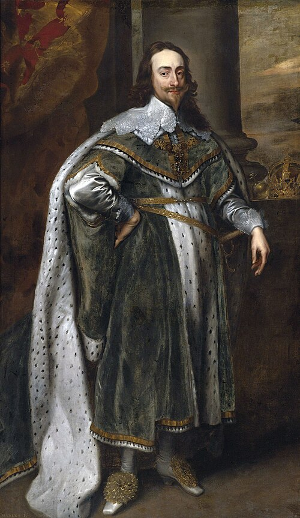

# Charles I of England

- **Name**: Charles I
- **Image**: King Charles I after original by van Dyck.jpg
- **Caption**: Portrait, 1636
- **Alt**: Charles in green robes. The Crown Jewels rest on a table behind him.
- **Succession**: King of England and Ireland
- **More Text**: (more...)
- **Reign**: 27 March 1625 – 30 January 1649
- **Coronation**: 2 February 1626
- **Cor Type**: britain
- **Predecessor**: James I
- **Successor**: Charles II (de jure); Council of State (de facto)
- **Succession1**: King of Scotland
- **More Text1**: (more...)
- **Reign1**: 27 March 1625 – 30 January 1649
- **Coronation1**: 18 June 1633
- **Predecessor1**: James VI
- **Successor1**: Charles II
- **Spouse**: Henrietta Maria of France (1625–present)
- **Religion**: Protestant
- **Issue**: Charles II; Mary, Princess of Orange; James VII & II; Elizabeth; Anne; Henry, Duke of Gloucester; Henrietta, Duchess of Orléans
- **Issue Link**: #Issue
- **Issue Pipe**: more...
- **House**: Stuart
- **Father**: James VI and I
- **Mother**: Anne of Denmark
- **Birth Date**: 19 November 1600
- **Birth Place**: Dunfermline Palace, Dunfermline, Scotland
- **Death Date**: 1649-01-30
- **Death Place**: Whitehall, Westminster, England
- **Death Cause**: Execution by beheading
- **Burial Date**: 9 February 1649
- **Burial Place**: St George's Chapel, Windsor Castle, England
- **Signature**: UK-Royal-Signature Charles.svg
