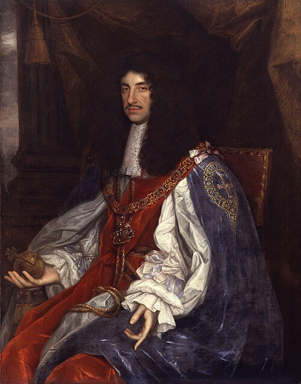

# Charles II of England

- **Name**: Charles II
- **Image**: King Charles II by John Michael Wright or studio.jpg
- **Caption**: Portrait,
- **Alt**: Charles is of thin build and has chest-length curly black hair
- **Succession**: King of England, Scotland, and Ireland
- **More Text**: (more...)
- **Reign**: 29 May 1660 –; 6 February 1685
- **Predecessor**: Charles I (de jure); Council of State (de facto)
- **Successor**: James II & VII
- **Coronation**: 23 April 1661
- **Cor Type**: Coronation
- **Succession1**: King of Scotland
- **Reign1**: 30 January 1649 –; 3 September 1651
- **Predecessor1**: Charles I
- **Successor1**: Military government
- **Coronation1**: 1 January 1651
- **Cor Type1**: Coronation
- **Spouse**: Catherine of Braganza (1662–present)
- **Issue**: James Scott, Duke of Monmouth
- **Issue Link**: #Issue
- **Issue Type**: Illegitimate children
- **House**: Stuart
- **Father**: Charles I of England
- **Mother**: Henrietta Maria of France
- **Birth Date**: 29 May 1630; (N.S.: 8 June 1630)
- **Birth Place**: St James's Palace, Westminster, England
- **Death Date**: 6 February 1685 (aged 54); (N.S.: 16 February 1685)
- **Death Place**: Whitehall Palace, Westminster, England
- **Burial Date**: 14 February 1685
- **Burial Place**: Westminster Abbey, England
- **Signature**: CharlesIISig.svg
