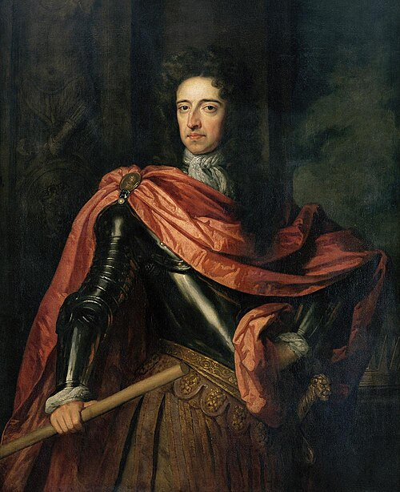

# William III & II

- **Name**: William III and II
- **Image**: King William III of England, (1650-1702).jpg
- **Caption**: Portrait,
- **Alt**: Colour oil painting of William
- **Succession**: King of England, Scotland, and Ireland
- **More Text**: (more...)
- **Reign**: 1689 – 8 March 1702
- **Coronation**: 11 April 1689
- **Cor Type**: Coronation
- **Predecessor**: James II & VII
- **Successor**: Anne
- **Regent**: Mary II (1689–1694)
- **Reg Type**: Co-monarch
- **Succession1**: Stadtholder of Holland, Zeeland, Utrecht, Guelders, and Overijssel
- **Reign1**: 4 July 1672 – 8 March 1702
- **Predecessor1**: First Stadtholderless Period
- **Successor1**: Second Stadtholderless Period
- **Succession2**: Prince of Orange
- **Reign2**: 4 November 1650 – 8 March 1702
- **Predecessor2**: William II
- **Successor2**: John William Friso (disputed)
- **Birth Date**: 4 November 1650 NS: 14 November 1650
- **Birth Place**: Binnenhof, The Hague, Dutch Republic
- **Death Date**: 8 March 1702 (aged 51) NS: 19 March 1702
- **Death Place**: Kensington Palace, Middlesex, England
- **Burial Date**: 12 April 1702
- **Burial Place**: Westminster Abbey
- **Spouse**: Mary II of England (4 November 1677–28 December 1694, died)
- **Religion**: Protestantism
- **Full Name**: William Henry; nl
- **House**: Orange-Nassau
- **Father**: William II, Prince of Orange
- **Mother**: Mary, Princess Royal
- **Signature**: WilliamIII Sig.svg
- **Battles**: Franco-Dutch War; Battle of Woerden; Siege of Charleroi; Siege of Naarden; Siege of Bonn; Battle of Seneffe; Siege of Grave; Siege of Maastricht; Battle of Cassel; Battle of Saint-Denis; Nine Years' War; 1688 invasion of England; Battle of the Boyne; Siege of Limerick; Battle of Steenkerque; Battle of Landen; Siege of Namur
- **Battles Label**: Conflicts
