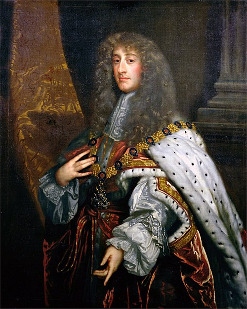

# James II & VII

- **Name**: James II and VII
- **Image**: James II by Peter Lely.jpg
- **Succession**: King of England, Scotland, and Ireland
- **More Text**: (more...)
- **Reign**: 6 February 1685 – 23 December 1688
- **Coronation**: 23 April 1685
- **Cor Type**: Coronation
- **Predecessor**: Charles II
- **Successor**: Mary II and William III & II
- **Suc Type**: Successors
- **Birth Date**: 14 October 1633; (N.S.: 24 October 1633)
- **Birth Place**: St James's Palace, Westminster, England
- **Death Date**: 16 September 1701 (aged 67) (N.S.)
- **Death Place**: Château de Saint-Germain-en-Laye, France
- **Spouses**: *Anne Hyde (1660–1671) *Mary of Modena (1673–present)
- **Issue**: * Charles, Duke of Cambridge * Mary II, Queen of England, Scotland, and Ireland * James, Duke of Cambridge * Anne, Queen of Great Britain and Ireland * Charles, Duke of Kendal * Edgar, Duke of Cambridge * Isabel Stuart * Charles, Duke of Cambridge * James, Prince of Wales * Louisa Maria Stuart Illegitimate: * Henrietta Butler, Viscountess Galmoye * James FitzJames, 1st Duke of Berwick * Henry FitzJames * Catherine Sheffield, Duchess of Buckingham and Normanby
- **Issue Link**: #Issue
- **Issue Pipe**: more...
- **House**: Stuart
- **Father**: Charles I of England
- **Mother**: Henrietta Maria of France
- **Religion**: *Protestant (1633–1668) *Catholic (1668–1701)
- **Burial Place**: Church of the English Benedictines, ParisMiller
- **Signature**: JamesIISig.svg
