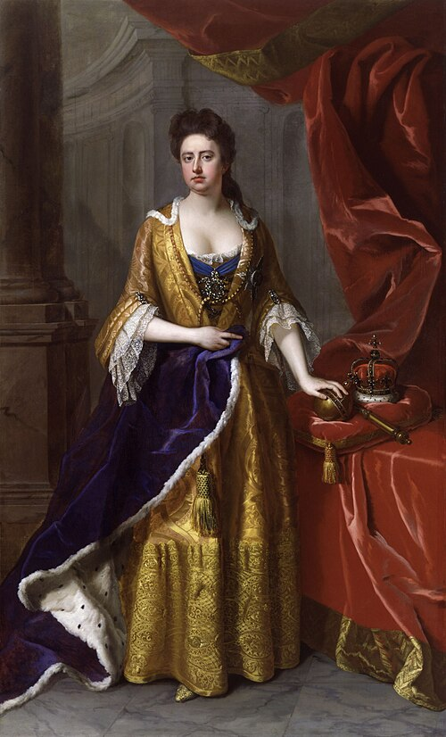

# Anne, Queen of Great Britain

- **Name**: Anne
- **Image**: Anne1705.jpg
- **Caption**: Portrait, 1705
- **Alt**: Anne in blue and yellow robes. The Crown Jewels are on a table to her left.
- **Succession**: Queen of England, Scotland, and Ireland
- **More Text**: (more...)
- **Reign**: 8 March 1702 – 1 May 1707
- **Cor Type**: Coronation
- **Coronation**: 23 April 1702
- **Predecessor**: William III & II
- **Succession1**: Queen of Great Britain and Ireland
- **Reign1**: 1 May 1707 – 1 August 1714
- **Successor1**: George I
- **Spouse**: Prince George of Denmark (28 July 1683–28 October 1708)
- **Issue**: Prince William, Duke of Gloucester
- **Issue Link**: #Pregnancies and issue
- **Issue Pipe**: more...
- **House**: Stuart
- **Father**: James II of England
- **Mother**: Anne Hyde
- **Birth Date**: 6 February 1665
- **Birth Place**: St James's Palace, Westminster, England
- **Death Date**: 1 August 1714 (aged 49)
- **Death Place**: Kensington Palace, London, England
- **Burial Date**: 24 August 1714
- **Burial Place**: Westminster Abbey
- **Signature**: Firma Reina Ana.svg
- **Signature Alt**: Signature of Queen Anne
- **Religion**: Anglicanism
