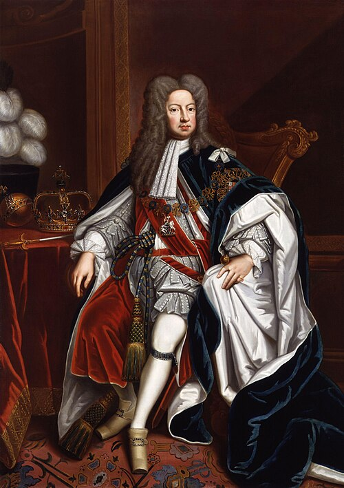

# George I of Great Britain

- **Name**: George I
- **Image**: King George I by Sir Godfrey Kneller, Bt (3).jpg
- **Caption**: Portrait, 1714
- **Alt**: George seated on the throne in the robes of the Order of the Garter
- **Succession**: King of Great Britain and Ireland
- **Reign**: 1 August 1714 – 11 June 1727
- **Coronation**: 20 October 1714
- **Cor Type**: britain
- **Predecessor**: Anne
- **Successor**: George II
- **Succession1**: Elector of Hanover
- **Reign1**: 23 January 1698 – 11 June 1727
- **Predecessor1**: Ernest Augustus
- **Successor1**: George II
- **Spouse**: Sophia Dorothea of Celle (1682–1694)
- **Issue**: George II of Great Britain; Sophia Dorothea of Hanover, Queen in Prussia; Melusina, Countess of Walsingham (ill.)
- **Issue Link**: #Issue
- **Issue Pipe**: more...
- **Full Name**: George Louis (de)
- **House**: Hanover
- **Father**: Ernest Augustus, Elector of Hanover
- **Mother**: Sophia of the Palatinate
- **Birth Date**: 28 May / 1660-06-07 (O.S./N.S.)
- **Birth Place**: Hanover, Brunswick-Lüneburg, Holy Roman Empire
- **Death Date**: 11/1727-06-22 (O.S./N.S.)
- **Death Place**: Schloss Osnabrück, Osnabrück, Holy Roman Empire
- **Burial Date**: 4 August 1727
- **Burial Place**: Leine Palace, Hanover; later Herrenhausen, Hanover
- **Signature**: George I Signature.svg
- **Signature Alt**: Signature of George I
- **Religion**: Protestant
