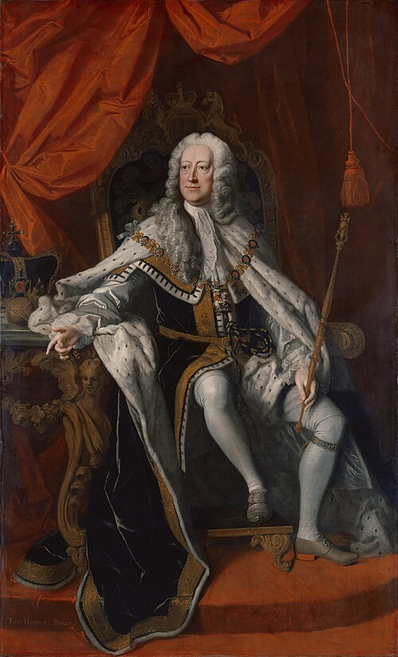

# George II of Great Britain

- **Name**: George II
- **Image**: George II by Thomas Hudson.jpg
- **Caption**: Portrait of George II by Thomas Hudson, 1744
- **Alt**: George sitting on a throne
- **Succession**: King of Great Britain and Ireland; Elector of Hanover
- **Reign**: 11/22 June 1727 – 25 October 1760
- **Coronation**: 11/22 October 1727
- **Cor Type**: Coronation
- **Predecessor**: George I
- **Successor**: George III
- **Spouse**: Caroline of Brandenburg-Ansbach (22 August 1705–20 November 1737)
- **Issue**: Frederick, Prince of Wales; Anne, Princess of Orange; Princess Amelia; Princess Caroline; Prince George William; Prince William, Duke of Cumberland; Mary, Landgravine of Hesse-Kassel; Louisa, Queen of Denmark and Norway
- **Issue Link**: #Issue
- **Full Name**: George Augustus (de)
- **House**: Hanover
- **Religion**: Protestant
- **Father**: George I of Great Britain
- **Mother**: Sophia Dorothea of Celle
- **Birth Date**: 30 October / 1683-11-09
- **Birth Place**: Herrenhausen Palace, or Leine Palace, Hanover
- **Death Date**: 1760-10-25
- **Death Place**: Kensington Palace, London, England
- **Burial Date**: 11 November 1760
- **Burial Place**: Westminster Abbey, London
- **Signature**: Firma del Rey George II.svg
- **Signature Alt**: George's signature in cursive
