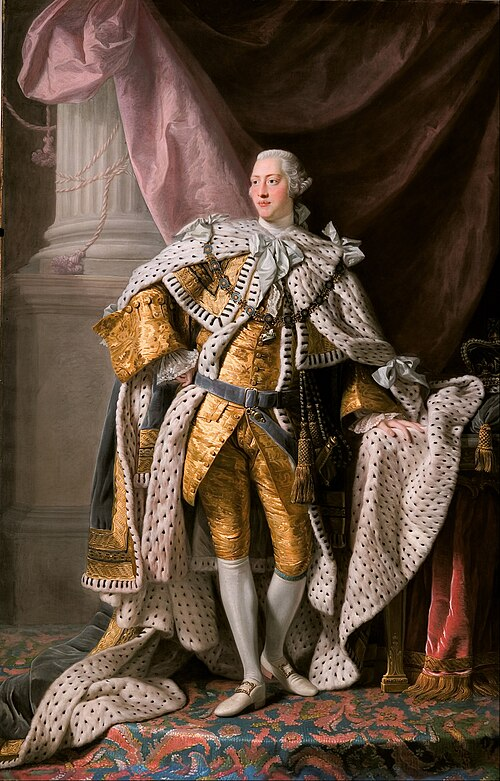

# George III

- **Image**: Allan Ramsay - King George III in coronation robes - Google Art Project.jpg
- **Caption**: Coronation portrait, 1762
- **Alt**: Full-length portrait in oils of a clean-shaven young George in eighteenth century dress: gold jacket and breeches, ermine cloak, powdered wig, white stockings, and buckled shoes.
- **Succession**: King of Great Britain and Ireland; Elector/King of Hanover
- **Reign**: 25 October 1760–29 January 1820
- **Coronation**: 22 September 1761
- **Cor Type**: Coronation
- **Predecessor**: George II
- **Regent**: George, Prince of Wales (18111820)
- **Successor**: George IV
- **Spouse**: Charlotte of Mecklenburg-Strelitz (1761–1818)
- **Issue**: George IV; Prince Frederick, Duke of York and Albany; William IV; Charlotte, Queen of Württemberg; Prince Edward, Duke of Kent and Strathearn; Princess Augusta Sophia; Elizabeth, Landgravine of Hesse-Homburg; Ernest Augustus, King of Hanover; Prince Augustus Frederick, Duke of Sussex; Prince Adolphus, Duke of Cambridge; Princess Mary, Duchess of Gloucester and Edinburgh; Princess Sophia; Prince Octavius; Prince Alfred; Princess Amelia
- **Issue Link**: #Issue
- **Full Name**: George William Frederick
- **House**: Hanover
- **Father**: Frederick, Prince of Wales
- **Mother**: Princess Augusta of Saxe-Gotha
- **Birth Date**: 1738-06-04 NS
- **Birth Place**: Norfolk House, London, England
- **Death Date**: 1820-01-29
- **Death Place**: Windsor Castle, Berkshire, England
- **Burial Date**: 16 February 1820
- **Burial Place**: Royal Vault, St George's Chapel, Windsor Castle
- **Signature**: George III Signature.svg
- **Signature Alt**: Handwritten "George" with a huge leading "G" and a large capital "R" at the end for "Rex"
- **Religion**: Anglicanism
