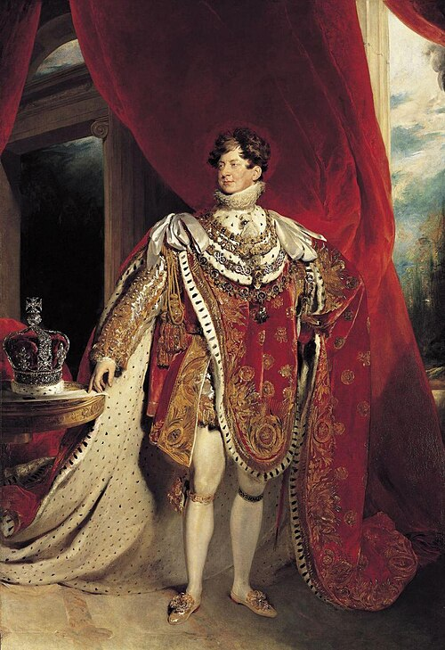

# George IV

- **Image**: King George IV of the United Kingdom in Coronation Robes (by Thomas Lawrence) - Royal Collection (RCIN 405918).jpg
- **Caption**: Coronation portrait, 1821
- **Alt**: George wears his coronation robes and four collars of chivalric orders: the Golden Fleece, Royal Guelphic, Bath and Garter.
- **Reign**: 29 January 1820 – 26 June 1830
- **Coronation**: 19 July 1821
- **Cor Type**: Coronation
- **Succession**: King of the United Kingdom and Hanover
- **Predecessor**: George III
- **Successor**: William IV
- **Reign Type2**: Regency
- **Reign2**: 5 February 1811 – 29 January 1820
- **Succession2**: Prince Regent of the United Kingdom
- **Pre Type2**: Monarch
- **Predecessor2**: George III
- **Spouse**: Caroline of Brunswick (1795–1821)
- **Issue**: Princess Charlotte of Wales
- **Full Name**: George Augustus Frederick
- **House**: Hanover
- **Religion**: Protestant
- **Father**: George III
- **Mother**: Charlotte of Mecklenburg-Strelitz
- **Birth Date**: 1762-08-12
- **Birth Place**: St James's Palace, London, England
- **Death Date**: 1830-06-26
- **Death Place**: Windsor Castle, Berkshire, England
- **Burial Date**: 15 July 1830
- **Burial Place**: Royal Vault, St George's Chapel, Windsor Castle
- **Signature**: George IV Signature.svg
- **Signature Alt**: Signature of George IV
