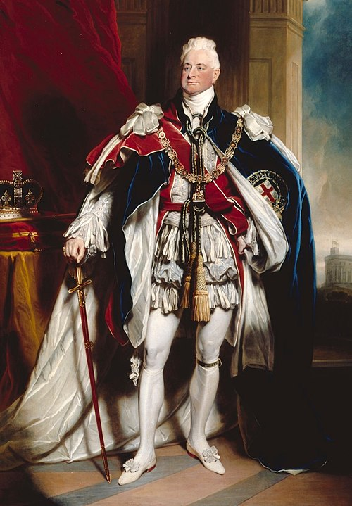

# William IV

- **Image**: William IV in 1833 by Shee cropped.jpg
- **Caption**: Portrait of William IV (1833)
- **Alt**: William in Garter Robes with his right hand on his sword and St Edward's Crown and sceptre beside him.
- **Succession**: King of the United Kingdom and Hanover
- **Reign**: 26 June 1830 – 20 June 1837
- **Coronation**: 8 September 1831
- **Cor Type**: Coronation
- **Predecessor**: George IV
- **Successor**: Victoria (United Kingdom); Ernest Augustus (Hanover)
- **Spouse**: Adelaide of Saxe-Meiningen (11 July 1818–present)
- **Issue**: * George FitzClarence, Earl of Munster * Sophia Sidney, Baroness De L'Isle and Dudley * Lady Mary Fox * Lord Frederick FitzClarence * Elizabeth Hay, Countess of Erroll * Lord Adolphus FitzClarence * Lady Augusta Gordon * Lord Augustus FitzClarence * Amelia Cary, Viscountess Falkland * Princess Elizabeth of Clarence
- **Issue Link**: #Issue
- **Issue Pipe**: more...
- **Full Name**: William Henry
- **House**: Hanover
- **Father**: George III
- **Mother**: Charlotte of Mecklenburg-Strelitz
- **Birth Date**: 1765-08-21
- **Birth Place**: Buckingham House, London, England
- **Death Date**: 1837-06-20
- **Death Place**: Windsor Castle, Berkshire, England
- **Burial Date**: 8 July 1837
- **Burial Place**: Royal Vault, St George's Chapel, Windsor Castle
- **Religion**: Protestant
- **Signature**: William IV Signature.svg
- **Signature Alt**: Cursive signature of William IV
- **Allegiance**: Great Britain
- **Branch**: Royal Navy
- **Service Years**: 1779–1790
- **Service Years Label**: Years of active service
- **Rank**: Rear admiral (active service)
- **Commands**: Valiant; Andromeda; Pegasus
- **Battles**: Battle of Cape St. Vincent
