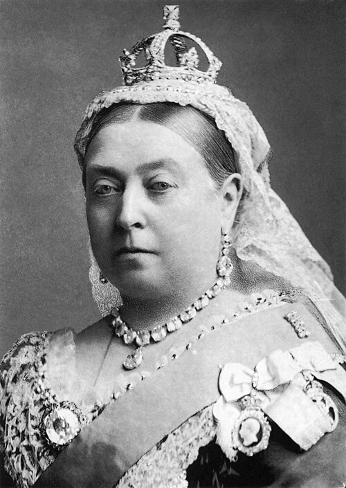

# Queen Victoria

- **Name**: Victoria
- **Image**: Queen Victoria by Bassano.jpg
- **Alt**: Victoria wearing a lace cap and diamond jewellery
- **Caption**: Formal portrait, 1882
- **Succession**: Queen of the United Kingdom
- **Reign**: 20 June 1837 – 22 January 1901
- **Coronation**: 28 June 1838
- **Cor Type**: Coronation
- **Predecessor**: William IV
- **Successor**: Edward VII
- **Reign1**: 1 May 1876 – 22 January 1901
- **Coronation1**: 1 January 1877
- **Cor Type1**: Imperial Durbar
- **Succession1**: Empress of India
- **Predecessor1**: Position established
- **Successor1**: Edward VII
- **Birth Name**: Princess Alexandrina Victoria of Kent
- **Birth Date**: 1819-05-24
- **Birth Place**: Kensington Palace, London, England
- **Death Date**: 1901-01-22
- **Death Place**: Osborne House, Isle of Wight, England
- **Burial Date**: 4 February 1901
- **Burial Place**: Royal Mausoleum, Frogmore, Windsor
- **Spouse**: Prince Albert of Saxe-Coburg and Gotha (10 February 1840–14 December 1861, died)
- **Issue**: * Victoria, German Empress * Edward VII * Alice, Grand Duchess of Hesse and by Rhine * Alfred, Duke of Saxe-Coburg and Gotha * Helena, Princess Christian of Schleswig-Holstein * Princess Louise, Duchess of Argyll * Prince Arthur, Duke of Connaught and Strathearn * Prince Leopold, Duke of Albany * Beatrice, Princess Henry of Battenberg
- **House**: Hanover
- **Father**: Prince Edward, Duke of Kent and Strathearn
- **Mother**: Princess Victoria of Saxe-Coburg-Saalfeld
- **Religion**: Protestant
- **Signature**: Queen Victoria Signature.svg
- **Signature Alt**: Cursive signature of Queen Victoria
