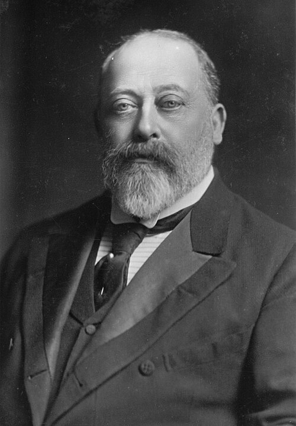

# Edward VII

- **Image**: File:King-Edward-VII (cropped) (b).jpg
- **Alt**: Studio photograph of Edward VII
- **Caption**: Formal portrait,
- **Succession**: King of the United Kingdom; and the British Dominions; Emperor of India
- **Reign**: 22 January 1901 – 6 May 1910
- **Coronation**: 9 August 1902
- **Cor Type**: Coronation
- **Coronation1**: 1 January 1903
- **Cor Type1**: Imperial Durbar
- **Predecessor1**: Victoria
- **Successor1**: George V
- **Birth Date**: 1841-11-09
- **Birth Place**: Buckingham Palace, London, England
- **Death Date**: 1910-05-06
- **Death Place**: Buckingham Palace
- **Burial Date**: 20 May 1910
- **Burial Place**: Royal Vault, St George's Chapel, Windsor Castle 28 November 1925; Albert Memorial Chapel, St George's Chapel; 22 April 1927; South Aisle, St George's Chapel
- **Spouse**: Alexandra of Denmark (10 March 1863–present)
- **Issue**: Prince Albert Victor; George V; Louise, Princess Royal; Princess Victoria; Maud, Queen of Norway; Prince Alexander John
- **Issue Link**: #Issue
- **Full Name**: Albert Edward
- **House**: Saxe-Coburg and Gotha
- **Father**: Prince Albert of Saxe-Coburg and Gotha
- **Mother**: Queen Victoria
- **Religion**: Protestant
- **Signature**: EdwardVII Signature.svg
- **Signature Alt**: Signature of Edward VII
