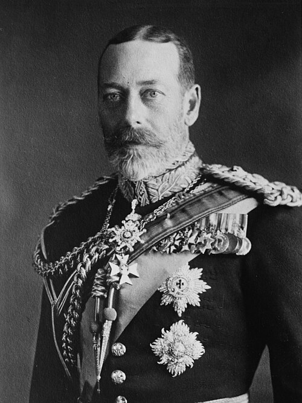

# George V

- **Image**: King George 1923 LCCN2014715558 (cropped).jpg
- **Caption**: Formal portrait, 1923
- **Alt**: George V is pale-eyed, grey-bearded, of slim build and wearing a uniform and medals.
- **Succession**: King of the United Kingdom; and the British Dominions; Emperor of India
- **Reign**: 6 May 1910 – 20 January 1936
- **Coronation**: 22 June 1911
- **Cor Type**: Coronation
- **Coronation1**: 12 December 1911
- **Cor Type1**: Imperial Durbar
- **Successor1**: Edward VIII
- **Predecessor1**: Edward VII
- **Birth Name**: Prince George of Wales
- **Birth Date**: 1865-06-03
- **Birth Place**: Marlborough House, Westminster, Middlesex, England
- **Death Date**: 1936-01-20
- **Death Place**: Sandringham House, Norfolk, England
- **Burial Date**: 28 January 1936
- **Burial Place**: Royal Vault, St George's Chapel, Windsor Castle 27 February 1939; North Nave Aisle, St George's Chapel
- **Spouse**: Mary of Teck (6 July 1893–present)
- **Issue**: Edward VIII; George VI; Mary, Princess Royal and Countess of Harewood; Prince Henry, Duke of Gloucester; Prince George, Duke of Kent; Prince John
- **Issue Link**: #Issue
- **Full Name**: George Frederick Ernest Albert
- **House**: Saxe-Coburg and Gotha (by birth); Windsor (founder)
- **Father**: Edward VII
- **Mother**: Alexandra of Denmark
- **Religion**: Protestant
- **Signature**: George V Signature.svg
- **Signature Alt**: Cursive signature of George V
- **Branch**: Royal Navy
- **Branch Label**: Service
- **Service Years**: 1877–1892
- **Service Years Label**: Years of active service
- **Rank**: Full list
- **Commands**: Torpedo Boat 79; Thrush; Melampus
- **Pos**: center
- **Filename**: First Royal Christmas message by George V.ogg
- **Title**: King George V's voice
- **Type**: speech
- **Description**: George delivers the first Royal Christmas Message; Recorded 25 December 1932
