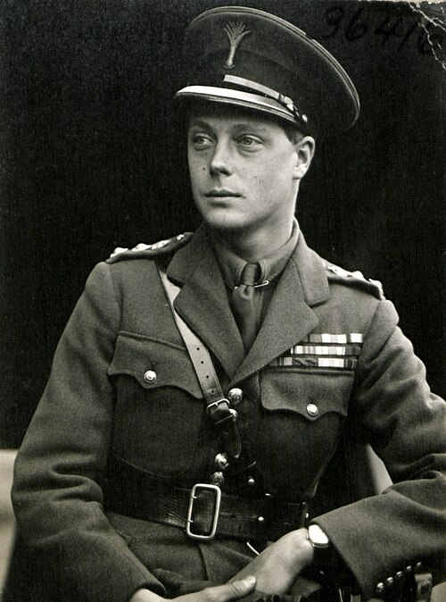

# Edward VIII

- **Title**: Duke of Windsor
- **Image**: HRH The Prince of Wales No 4 (HS85-10-36416).jpg
- **Caption**: Edward as Colonel of the Welsh Guards in 1919
- **Alt**: A photograph of Edward aged 25
- **Succession**: King of the United Kingdom; and the British Dominions; Emperor of India
- **Reign**: 1936-01-20–1936-12-11
- **Predecessor**: George V
- **Successor**: George VI
- **Spouse**: Wallis Simpson (3 June 1937–present)
- **Full Name**: Edward Albert Christian George Andrew Patrick David
- **House**: Saxe-Coburg and Gotha (until 1917); Windsor (from 1917)
- **Father**: George V
- **Mother**: Mary of Teck
- **Birth Name**: Prince Edward of York
- **Birth Date**: 1894-06-23
- **Birth Place**: White Lodge, Richmond Park, Surrey, England
- **Death Date**: 1972-05-28
- **Death Place**: 4 route du Champ d'Entraînement, Paris, France
- **Burial Date**: 5 June 1972
- **Burial Place**: Royal Burial Ground, Frogmore, Windsor, Berkshire
- **Signature**: Edwardsig.svg
- **Signature Alt**: Edward's signature in black ink
- **Religion**: Protestant
- **Education**: Royal Naval College, Osborne; Britannia Royal Naval College; Magdalen College, Oxford
