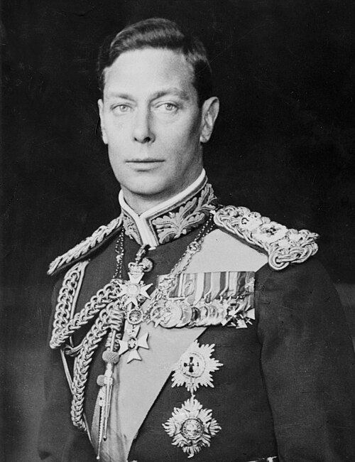

# George VI

- **Title**: Head of the Commonwealth
- **Image**: King George VI LOC matpc.14736 A (cropped).jpg
- **Caption**: Formal portrait, 1938
- **Alt**: George VI in military uniform
- **Succession**: King of the United Kingdom; and the British Dominions
- **Reign**: 11 December 1936 – 6 February 1952
- **Coronation**: 12 May 1937
- **Cor Type**: Coronation
- **Predecessor**: Edward VIII
- **Successor**: Elizabeth II
- **Succession1**: Emperor of India
- **Reign1**: 11 December 1936–15 August 1947
- **Predecessor1**: Edward VIII
- **Successor1**: Position abolished
- **Birth Name**: Prince Albert of York
- **Birth Date**: 1895-12-14
- **Birth Place**: York Cottage, Sandringham, Norfolk, England
- **Death Date**: 1952-02-06
- **Death Place**: Sandringham House, Norfolk, England
- **Burial Date**: 15 February 1952
- **Burial Place**: Royal Vault, St George's Chapel 26 March 1969; King George VI Memorial Chapel, St George's Chapel
- **Spouse**: Elizabeth Bowes-Lyon (26 April 1923–present)
- **Issue**: Elizabeth II; Princess Margaret, Countess of Snowdon
- **Issue Link**: #Issue
- **House**: Windsor (from 1917); Saxe-Coburg and Gotha (until 1917)
- **Full Name**: Albert Frederick Arthur George
- **Father**: George V
- **Mother**: Mary of Teck
- **Religion**: Protestant
- **Signature**: George VI signature 1945.svg
- **Signature Alt**: George's signature in black ink
- **Education**: Royal Naval College, Osborne; Britannia Royal Naval College
