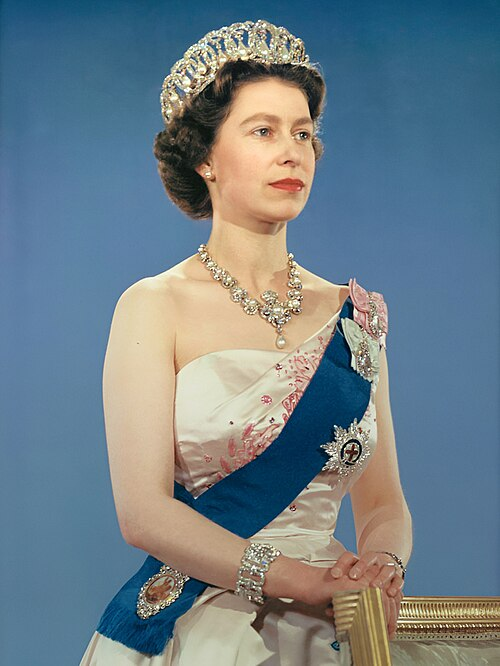

# Elizabeth II

- **Title**: Head of the Commonwealth
- **Image**: Queen Elizabeth II official portrait for 1959 tour (retouched) (cropped) (3-to-4 aspect ratio).jpg
- **Alt**: Elizabeth facing right in a half-length portrait photograph
- **Caption**: Formal portrait, 1959
- **Succession**: Queen of the United Kingdom; and other Commonwealth realms
- **More Text**: (full list)
- **Reign**: 6 February 1952–8 September 2022
- **Cor Type**: Coronation
- **Coronation**: 2 June 1953
- **Predecessor**: George VI
- **Successor**: Charles III
- **Birth Name**: Princess Elizabeth of York
- **Birth Date**: 1926-04-21
- **Birth Place**: 17 Bruton Street, Mayfair, London, England
- **Death Date**: 2022-09-08
- **Death Place**: Balmoral Castle, Aberdeenshire, Scotland
- **Burial Date**: 19 September 2022
- **Burial Place**: King George VI Memorial Chapel, St George's Chapel, Windsor Castle
- **Spouse**: Prince Philip, Duke of Edinburgh (20 November 1947–9 April 2021, d)
- **Issue**: Charles III; Anne, Princess Royal; Andrew Mountbatten-Windsor; Prince Edward, Duke of Edinburgh
- **Full Name**: Elizabeth Alexandra Mary
- **House**: Windsor
- **Father**: George VI
- **Mother**: Elizabeth Bowes-Lyon
- **Religion**: Protestant
- **Signature**: Elizabeth II signature 1952.svg
- **Signature Alt**: Elizabeth's signature in black ink
- **Filename**: Elizabeth II Coronation speech.ogg
- **Description**: Coronation Day speech
- **Recorded**: 2 June 1953
