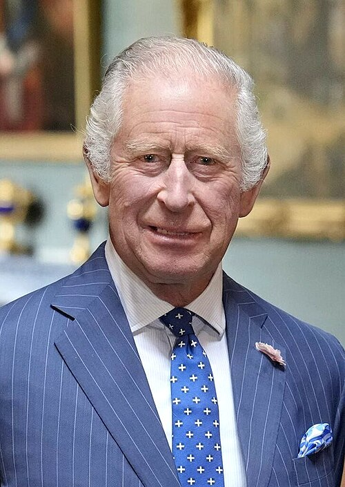

# Charles III

- **Title**: Head of the Commonwealth
- **Image**: King Charles III (July 2023).jpg
- **Alt**: Photograph of Charles
- **Caption**: Charles in 2023
- **Succession**: King of the United Kingdom; and the other Commonwealth realms
- **Reign**: 8 September 2022–present
- **Cor Type**: Coronation
- **Coronation**: 6 May 2023
- **Predecessor**: Elizabeth II
- **Suc Type**: Heir apparent
- **Successor**: William, Prince of Wales
- **Birth Name**: Prince Charles of Edinburgh
- **Birth Date**: 1948-11-14
- **Birth Place**: Buckingham Palace, London, England
- **Spouses**: Diana Spencer (29 July 1981–28 August 1996, divorced); Camilla Parker Bowles (9 April 2005–present)
- **Issue**: William, Prince of Wales; Prince Harry, Duke of Sussex
- **Full Name**: Charles Philip Arthur George
- **House**: Windsor
- **Father**: Prince Philip, Duke of Edinburgh
- **Mother**: Elizabeth II
- **Signature**: King Charles.svg
- **Signature Alt**: Charles's signature in black ink
- **Religion**: Protestant
- **Education**: Trinity College, Cambridge (MA)
- **Office**: Member of the House of Lords; Lord Temporal
- **Term Label**: Hereditary peerage
- **Term Start**: 11 February 1970
- **Term End**: 11 November 1999
- **Allegiance**: United Kingdom
- **Branch**: Royal Navy; Royal Air Force
- **Service Years**: 1971–1976
- **Service Years Label**: Years of active service
- **Rank**: full list
- **Commands**: Bronington
- **Filename**: King Charles Addresses Scottish Parliament - 12 September 2022.flac
- **Description**: Speech to the Scottish Parliament following the death of his mother, Queen Elizabeth II
- **Name**: King Charles III
- **Recorded**: 12 September 2022
